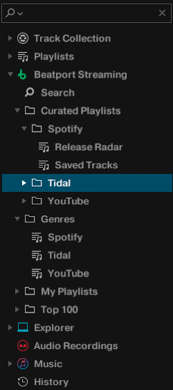

# traktor-streaming-proxy
Allow Traktor DJ to stream music from YouTube, Spotify, and Tidal by faking Beatport's API

</a>

Traktor DJ supports streaming of music tracks, but only from the Beatport and Beatsource services.
This project aims to integrate other streaming sources into Traktor DJ via Beatport Streaming.
It consists of an API server based on ktor which fakes some relevant parts of the Beatport API to serve custom content.

Currently, it supports YouTube Music (via NewPipe), Spotify, and Tidal with support for searching for music and browsing saved tracks and playlists.
In theory other streaming services or self-hosted sources will be possible to integrate as long as they serve music files in mp4a audio format, since Traktor refuses to load other formats (even though these formats are supported for local files).
As a workaround, an on-the-fly format conversion of the music files should be possible at some cost in quality and time.

As with Beatport streaming, Traktor does not allow to use the build-in recorder.

The project now contains a fully crafted Beatport license file that allows the server to handle linking and authentication, with enabling all features such as track analysis and simultaneous playback of multiple decks. You no longer need to take care of the license file or have a Beatport account with subscription! :)

Please note this project and the setup instructions are only tested on macOS. While it is possible to set it up on Windows in a similar way, Traktor on Windows uses different client certificates and does not work with the license file in this project (but there is a trick to get it working https://github.com/0xf4b1/traktor-streaming-proxy/issues/13#issuecomment-1742184706).

## Setup

1. Get the latest [release](https://github.com/0xf4b1/traktor-streaming-proxy/releases) and unzip.

2. Configure the server by adjusting the `config.properties` file. Both Spotify and Tidal sources require an account.

3. (Optional) Install ffmpeg on your system if you want to use the spotify source.

4. SSL trust

Recent versions of Traktor do not trust the generated certificate and refuse to connect to the server. The certificate verification can be bypassed by preloading a small stub library that lets the respective function always pass to effectively disable the check.

You need to create a code signing certificate in Keychain Access -> Certificate Assistant -> Create a certificate ...

Enter a name, e.g. "code", and choose Certificate Type: Code Signing and click Create.

Afterwards resign the Traktor binary with the following command:

```
sudo codesign --force --sign "code" "/Applications/Native Instruments/Traktor Pro 3/Traktor.app/Contents/MacOS/Traktor"
```

Then either get the prebuilt stub `SecTrustEvaluateStub.dylib` from [releases](https://github.com/0xf4b1/traktor-streaming-proxy/releases) or build it yourself:

```
cd cert
make
```

5. Run the server from the directory where the config.properties file is located

```
bin/traktor-streaming-proxy
```

6. Redirect ports 80 -> 8080 and 443 -> 8443

```
sudo pfctl -f pf.conf
sudo pfctl -e
```

7. Redirect `api.beatport.com` to the server by adding the following to `/private/etc/hosts` on macOS

```
127.0.0.1   api.beatport.com
```

8. Run Traktor with the following command

```
DYLD_INSERT_LIBRARIES=./SecTrustEvaluateStub.dylib "/Applications/Native Instruments/Traktor Pro 3/Traktor.app/Contents/MacOS/Traktor"
```

If you are not yet linked with the server, open settings and connect to Beatport streaming. You should receive an immediate redirect which connects Traktor.

9. Done! If you navigate to Beatport Streaming, you should be able to browse through the predefined categories and use the search box to find content.

## Library Mapping

Beatport Streaming has the following predefined categories, which we try to match to our available sources in the best possible way.
The genres are identical in each category, which is why we use them to differentiate between the sources.

```
Curated Playlists
- <Genres>         --> source
 - <Playlists>     --> followed artists
  - <Tracks>       --> tracks from artist
Genres
- <Genres>         --> source
 - <Tracks>        --> saved/liked tracks in source
Playlists
- <Playlists>      --> playlists (all sources merged)
 - <Tracks>        --> tracks from playlist
Top 100
- <Genres>         --> source
 - <Tracks>        --> generated playlist of new released tracks
```