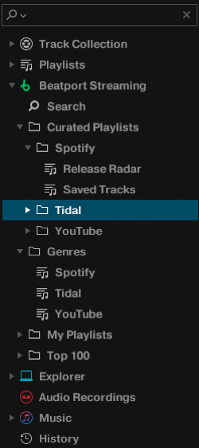

# traktor-streaming-proxy

Allow Traktor DJ to stream music from YouTube, Spotify, and Tidal by faking Beatport's API

</a>

Traktor DJ supports streaming of music tracks, but only from the Beatport and Beatsource services.
This project aims to integrate other streaming sources into Traktor DJ via Beatport Streaming.
It consists of an API server based on ktor which fakes some relevant parts of the Beatport API to serve custom content.

Currently, it supports YouTube Music (via NewPipe), Spotify, and Tidal with support for searching for music and browsing saved tracks and playlists.
In theory other streaming services or self-hosted sources will be possible to integrate as long as they serve music files in mp4a audio format, since Traktor refuses to load other formats (even though these formats are supported for local files).
As a workaround, an on-the-fly format conversion of the music files should be possible at some cost in quality and time.

As with Beatport streaming, Traktor does not allow to use the build-in recorder.

The project now contains a fully crafted Beatport license file that allows the server to handle linking and authentication, with enabling all features such as track analysis and simultaneous playback of multiple decks. You no longer need to take care of the license file or have a Beatport account with subscription! :)

## Setup

### MacOS

1. Get the latest [release](https://github.com/0xf4b1/traktor-streaming-proxy/releases) and unzip.

   **Option A (Recommended):** Use the precompiled binary from the release
   - Download and unzip the release - it contains a precompiled `bin/traktor-streaming-proxy`
   - You can optionally symlink it: `ln -s /path/to/unzipped/release traktor-streaming-proxy`

   **Option B:** Build from source
   - Clone the repository: `git clone https://github.com/0xf4b1/traktor-streaming-proxy.git`
   - Build with: `./gradlew build`
   - This creates `bin/traktor-streaming-proxy`

2. Configure the server by adjusting the `config.properties` file. Both Spotify and Tidal sources require an account.

3. (Optional) Install ffmpeg on your system if you want to use the spotify source.

4. SSL trust and Code Signing (OSX Tahoe and later)

Recent versions of macOS and Traktor (especially on OSX Tahoe/15.x) require proper code signing for binaries, and they do not trust the custom-generated certificate used by this proxy. The certificate verification can be bypassed by preloading a small stub library that intercepts certificate validation to effectively disable the security check.

#### Step 4a: Create a Self-Signed Code Signing Certificate

You need to create a local code signing certificate in Keychain Access. This certificate will be used to sign both the Traktor binary and the stub library.

1. Open **Keychain Access** (Applications → Utilities → Keychain Access)
2. Go to menu: **Keychain Access → Certificate Assistant** and choose **Open**
3. Select **"Create a certificate for yourself"** from the options presented
4. In the dialog that appears, fill in:
   - **Name:** Enter `traktor-code-sign` (or any name you prefer)
   - **Identity Type:** Select `Self Signed Root`
   - **Certificate Type:** Select `Code Signing`
5. Check the box **"Let me override defaults"** to see additional options if you want to customize validity period or other settings
6. Click **Create** and confirm when prompted to create the certificate and finally click **Done**

The certificate is now stored in your local Keychain.

#### Step 4b: Trust the Certificate for Code Signing

To enable code signing with this certificate, you need to add it to your trusted certificates:

1. In Keychain Access, find the certificate you just created (`traktor-code-sign`)
2. Double-click it to open the certificate details
3. Expand the **Trust** section
4. For **Code Signing**, select **Always Trust**
5. Close the window and enter your password when prompted
6. Your certificate is now trusted for code signing

#### Step 4c: Build the Stub Library

The proxy intercepts the SSL certificate verification in Traktor by injecting a stub library that bypasses security checks.

Build the stub library locally:

```bash
cd cert
make
```

This will compile `SecTrustEvaluateStub.c` into a signed `.dylib` library and automatically sign it with your code signing certificate. The `SecTrustEvaluateStub.dylib` file will be created in the `cert/` directory.

If `make` fails (e.g., you don't have a C compiler or build tools installed), install Xcode Command Line Tools:

```bash
xcode-select --install
```

Then try the `make` command again.

#### Step 4d: Code Sign the Traktor Binary

Before code signing, verify your certificate name exactly matches what you created. You can list available code signing certificates with:

```bash
# Search all keychains for your certificate
security find-certificate -c traktor-code-sign ~/Library/Keychains/login.keychain-db
```

If neither command finds it, open **Keychain Access**, make sure you're viewing your **login** keychain (not System), and search for `traktor-code-sign` to verify it was created successfully.

Now resign the Traktor binary with your certificate. Replace `traktor-code-sign` with your actual certificate name if different:

```bash
sudo codesign --force --deep --strict --sign "traktor-code-sign" "/Applications/Native Instruments/Traktor Pro 3/Traktor.app"
sudo codesign --force --deep --strict --sign "traktor-code-sign" "/Applications/Native Instruments/Traktor Pro 4/Traktor Pro 4.app"
```

This command:

- `--force`: Force resigning even if already signed
- `--deep`: Sign all nested code (recommended for app bundles)
- `--strict`: Ensure signed code meets strict requirements on Tahoe
- `--sign`: Use the specified certificate identity

#### Step 4e: Verify the Signatures

After signing, verify that both the Traktor binary and stub library are properly signed:

```bash
# View detailed signing info
codesign -d -v "/Applications/Native Instruments/Traktor Pro 3/Traktor.app"
codesign -d -v "/Applications/Native Instruments/Traktor Pro 4/Traktor Pro 4.app"
codesign -d -v /path/to/traktor-streaming-proxy/cert/SecTrustEvaluateStub.dylib
```

You should see output like: `valid on disk` or `code object is valid`

#### Step 4f: Troubleshooting Code Signing Issues

- **"Certificate not found"**: Make sure the certificate name exactly matches what you created in Keychain Access
- **"code object is not signed"**: Re-run the codesign command with `--force` flag
- **Traktor still refuses connection**: Make sure you're running Traktor with the stub library injected (see step 9)
- **"Invalid signature"** on Tahoe: Use the `--strict` flag when signing

5. Run the server from the directory where the config.properties file is located

```
bin/traktor-streaming-proxy
```

6. Redirect ports 80 -> 8080 and 443 -> 8443

```
sudo pfctl -f pf.conf
sudo pfctl -e
```

7. Redirect `api.beatport.com` to the server by adding the following to `/private/etc/hosts` on macOS

```
127.0.0.1   api.beatport.com
```

8. Verify that the setup is working correctly

```
curl -k https://api.beatport.com/v4/catalog/genres/
```

The result should be a JSON response similar to the following depending on your enabled sources:

```
{
    "results": [
        {
            "id": 1,
            "name": "YouTube"
        }
    ]
}
```

If you get an error or something different, it will not work with Traktor and you need to fix your setup.

9. Run Traktor with the stub library injected

**Important:** Before launching Traktor, make sure your proxy server is already running (see step 5).

Navigate to the traktor-streaming-proxy **root directory** and run Traktor with the stub library:

```bash
cd /path/to/traktor-streaming-proxy
DYLD_INSERT_LIBRARIES=./cert/SecTrustEvaluateStub.dylib "/Applications/Native Instruments/Traktor Pro 3/Traktor.app/Contents/MacOS/Traktor"
DYLD_INSERT_LIBRARIES=./cert/SecTrustEvaluateStub.dylib "/Applications/Native Instruments/Traktor Pro 4/Traktor Pro 4.app/Contents/MacOS/Traktor Pro 4"
```

When Traktor launches and shows the **Beatport login screen**, the proxy will handle authentication automatically using the built-in license. You don't need an actual Beatport account. The authentication should complete automatically and redirect you to the proxy.

**Browser Note:** For the one-time Beatport authentication/login flow, it may be necessary to set **Safari as your default browser**. Some authentication flows may use the system default browser, and Firefox is known to have compatibility issues with this proxy's authentication mechanism. After successful authentication, you can change your default browser back to your preferred choice.

10. Access your streaming sources

Once authenticated, open **Beatport Streaming** in Traktor. You should see the sources you configured in `config.properties` (YouTube, Spotify, Tidal) instead of the regular Beatport content. You can now:

- Browse curated playlists
- Search for music
- Access your saved tracks and playlists
- Stream music directly to Traktor

If the authentication doesn't complete or you don't see your sources, check that:

- The proxy server is running (`bin/traktor-streaming-proxy`)
- Your config.properties is properly configured with enabled sources
- Your `/private/etc/hosts` file has the `127.0.0.1 api.beatport.com` entry
- The port redirects are active (`sudo pfctl -e` and `sudo pfctl -f pf.conf`)

### Windows

Huge thanks to [@v1nc](https://github.com/v1nc) for providing a working setup for Windows and the Traktor patcher!

1. Install Docker desktop [with WSL](https://docs.docker.com/desktop/features/wsl/)
2. Enable "Start Docker Desktop when you sign in to your computer" in the Docker Desktop settings to make it run at login
3. Start an Ubuntu WSL shell (or your preferred distribution)
4. Clone this repository: `git clone https://github.com/0xf4b1/traktor-streaming-proxy.git` and navigate to the folder: `cd traktor-streaming-proxy`
5. Adjust the `src/main/dist/config.properties` file to your needs. Make sure to change `beatport.license` to `windows` and `server.useKeystore` to `true`.
6. Generate the required SSL certificates by running `./cert/gen-cert.sh`.
7. Trust the generated `./cert/server.crt` on your machine: For Ubuntu WSL, go to `\\wsl.localhost\Ubuntu\home\username\traktor-streaming-proxy\cert` in you explorer, click on `server.crt`, select _Install certificate_, select _Local computer_, click _Next_, select _All certificates_ and choose _Trusted Root Certification Authorities_, then install the certificate.
8. Create and start Docker image:

```
docker build -t traktor-streaming-proxy .
docker run -d --name traktor-streaming-proxy-container -p 443:8443 --restart always traktor-streaming-proxy
```

9. Make your system use the proxy by appending the following line to your `C:\Windows\System32\drivers\etc\hosts` file:

```
127.0.0.1   api.beatport.com
```

10. You should now be able to open `https://api.beatport.com/v4/catalog/genres/` in your browser and see the configured providers without any SSL warnings or errors.
11. Patch `Traktor.exe` to make it accept the custom beatport license: Run `python patch_traktor.py` and input the path to your `Traktor.exe`. If you copy your `Traktor.exe` to the path mentioned in 7., you can run it in WSL so you don't need to install Python on Windows. After that copy back the patched binary to the Traktor program path. Alternatively, see the notes below to patch it manually.
12. Run the patched Traktor binary, go to _settings_, _streaming_ and click _Login on Beatport_. If you just booted your device, wait a minute for the docker container to start. If you start Traktor before the container runs, you will need to click _Login to Beatport_ again
13. Everything should work :)

#### Notes

the `patch_traktor.py` script was only tested on Traktor version 4.11.23 but should work on any version that uses the same certificate. If it does not work for you, you can patch the `Traktor.exe` manually: 1. Download a hex editor like [hxd](https://mh-nexus.de/de/hxd/) 2. Backup `C:\Program Files\Native Instruments\Traktor xx\Traktor.exe` and open it with your hex editor 3. Search for `-----BEGIN PUBLIC KEY-----`. It should be the first occurrence, but verify it is the windows key listed [here](https://github.com/0xf4b1/traktor-streaming-proxy/issues/13#issuecomment-1742184706) 4. Replace the key with the mac key listed [here](https://github.com/0xf4b1/traktor-streaming-proxy/issues/13#issuecomment-1742184706). Dots in the hex editor represent new lines, so the best way is to replace the key line per line, leaving the dots where they are. 5. Save the binary, if hxd warns you about a changing binary size, you did something wrong. 6. Copy the binary back to `C:\Program Files\Native Instruments\Traktor xx\` if you moved it. Run it to verify it works 7. Obviously you can not use the usual Beatport API with this version

`Cannot execute BPM-detection due to missing transients. Please analyze first`

This issue is related to the used codec in the downloaded audio file. We are currently working on a fix.

## Library Mapping

Beatport Streaming has the following predefined categories, which we try to match to our available sources in the best possible way.
The genres are identical in each category, which is why we use them to differentiate between the sources.

```
Curated Playlists
- <Genres>         --> source
 - <Playlists>     --> followed artists
  - <Tracks>       --> tracks from artist
Genres
- <Genres>         --> source
 - <Tracks>        --> saved/liked tracks in source
Playlists
- <Playlists>      --> playlists (all sources merged)
 - <Tracks>        --> tracks from playlist
Top 100
- <Genres>         --> source
 - <Tracks>        --> generated playlist of new released tracks
```
